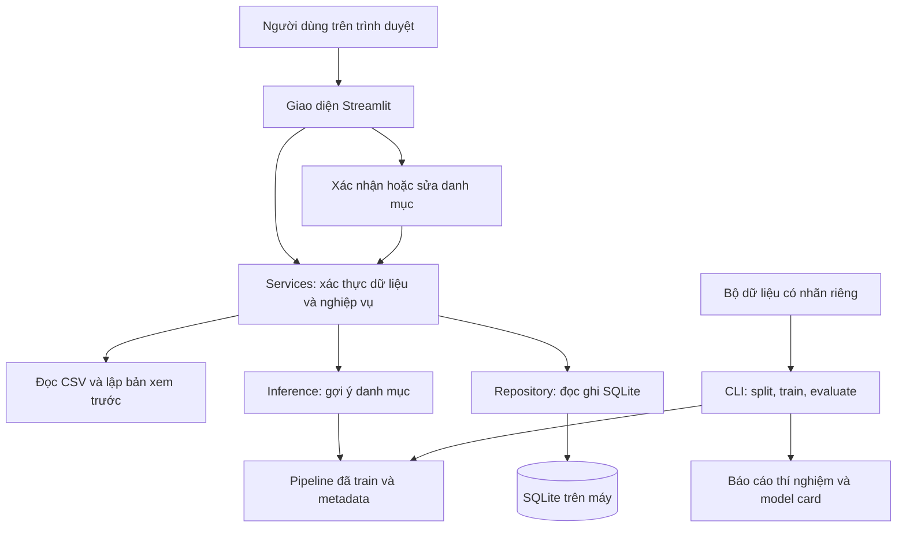

# SpendWise AI — Tài liệu thiết kế

Ngày soạn: 05/10/2026. Phiên bản thiết kế: 0.1. Trạng thái: chuẩn bị triển khai; chưa có ứng dụng hoặc mô hình đã huấn luyện.

Tài liệu này cụ thể hoá đặc tả trong `01_requirements.md`. Các lựa chọn dưới đây là kiến trúc đề xuất cho đồ án trên máy cá nhân. Khả năng chạy và thời gian phản hồi phải được đo trên máy thật trong giai đoạn P1 và P5. Đọc cùng `05_data_and_ml.md` để hiểu quy trình dữ liệu và thí nghiệm.

## 1. Phạm vi kỹ thuật

Ứng dụng giúp sinh viên và người mới đi làm ghi nhận thu/chi bằng nhập tay hoặc CSV theo mẫu, xem tổng hợp theo tháng và nhận gợi ý danh mục cho mô tả khoản chi tiếng Việt. Người dùng xác nhận danh mục trước khi lưu. Bài toán học máy chính là phân loại văn bản vào 8 danh mục cố định.

Phiên bản đầu chạy trên một máy, cho một người dùng tại một thời điểm, truy cập bằng trình duyệt qua `localhost`. Không cần ngân hàng, tài khoản đám mây, API trả phí hoặc GPU. Phần mềm và API có ngân sách 0 đồng; thiết bị và điện dùng nguồn sẵn có. Cần Internet lúc tải thư viện và tài liệu; sau cài đặt, các chức năng chính dùng dữ liệu và mô hình trên máy.

## 2. Các quyết định thiết kế

| Mã | Quyết định | Lý do và giới hạn |
|---|---|---|
| ADR-01 | Python + Streamlit | Dùng một ngôn ngữ cho xử lý dữ liệu, AI và giao diện để giảm lượng kiến thức phải học cùng lúc. Giao diện đủ cho demo và thử nghiệm một người dùng. |
| ADR-02 | SQLite qua thư viện `sqlite3` | Không vận hành máy chủ cơ sở dữ liệu. Dùng giao dịch để nhập CSV toàn bộ hoặc không ghi dòng nào. |
| ADR-03 | TF-IDF + Naive Bayes/Logistic Regression | Tự huấn luyện các mô hình có giám sát trên CPU, có thể giải thích và so sánh. Chọn mô hình bằng validation, không mặc định Logistic Regression sẽ tốt nhất. |
| ADR-04 | AI chỉ gợi ý danh mục | Tổng tiền, số liệu và việc ghi dữ liệu dùng quy tắc xác định. Tất cả gợi ý phải được người dùng xác nhận, kể cả score cao. |
| ADR-05 | Số tiền là số nguyên VND dương | Tránh sai số số thực. Chiều thu/chi nằm trong `transaction_type`; không dùng số âm để biểu diễn khoản chi. |
| ADR-06 | Bộ dữ liệu huấn luyện tách khỏi cơ sở dữ liệu giao dịch | Nhãn được sửa trong ứng dụng không tự động trở thành dữ liệu train. Muốn tái sử dụng phải có đồng ý, loại thông tin nhận dạng, kiểm tra nhãn và tạo phiên bản dữ liệu mới. |
| ADR-07 | Một quy trình train riêng, ứng dụng chỉ nạp artifact | Không huấn luyện lại mỗi lần mở trang. Mỗi run lưu cấu hình, môi trường, split, metrics và model card để tái lập thí nghiệm. |
| ADR-08 | Tách UI, nghiệp vụ, lưu trữ và AI | Có thể kiểm tra quy tắc tiền/CSV mà không mở giao diện; có thể dùng ứng dụng thủ công khi mô hình thiếu hoặc lỗi. |

Không ghi số phiên bản thư viện giả định vào đây. P1 sẽ chọn Python và các phiên bản tương thích thực tế, kiểm tra môi trường, rồi tạo `requirements.lock.txt`. Khi đổi môi trường, phải kiểm tra lại mô hình thay vì coi artifact cũ luôn tương thích.

## 3. Kiến trúc tổng thể



`Streamlit` chỉ nhận thao tác, hiển thị lỗi và gọi services. Services kiểm tra đầu vào, xử lý preview/confirmation, áp dụng quy tắc chống trùng và tính tổng. Repository dùng SQL có tham số; UI không ghép chuỗi SQL. Module inference nhận mô tả và trả một kết quả có cấu trúc, không ghi SQLite.

Quy trình huấn luyện không đọc ngầm database giao dịch. Một run chỉ được dùng snapshot dataset được chỉ định rõ trên dòng lệnh. Vì vậy, demo ứng dụng và đo chất lượng AI là hai hoạt động có đầu vào khác nhau.

## 4. Cấu trúc mã nguồn dự kiến

Các đường dẫn dưới đây là cấu trúc sẽ được tạo khi triển khai, không phải danh sách file đã hoàn thành trong bộ SDD.

```text
spendwise-ai/
  app.py                         # Điểm chạy Streamlit
  src/spendwise/
    domain/                      # Kiểu dữ liệu, danh mục, quy tắc xác thực
    services/                    # Giao dịch, import, báo cáo, gợi ý AI
    repositories/                # Kết nối, migrations, truy vấn SQLite
    ml/                          # Chuẩn hoá văn bản, baseline, pipeline, inference
    ui/                          # Form và các trang Streamlit
  scripts/
    validate_dataset.py
    split_dataset.py
    train.py
    evaluate.py
  tests/                         # Tests nghiệp vụ, import, ML contract, tích hợp
  data/
    examples/                    # CSV minh hoạ được phép chia sẻ
    private/                     # Dataset thật đã đồng ý; không đưa vào Git
    splits/                      # Manifest train/validation/test
  local/                         # SQLite và dữ liệu người dùng; không đưa vào Git
  artifacts/runs/<run_id>/        # Kết quả thí nghiệm; kiểm tra trước khi chia sẻ
  requirements.in
  requirements.lock.txt
  .gitignore
```

`csv`, `sqlite3`, `datetime`, `uuid`, `hashlib` thuộc thư viện chuẩn Python. `Streamlit`, `scikit-learn`, `pandas`, `joblib` là các phụ thuộc dự kiến; `pytest` dùng cho kiểm tra. Chỉ thêm thư viện khi có nhiệm vụ cụ thể cần đến. CSV phải được parse với kiểu tiền được kiểm soát, không phụ thuộc cơ chế tự đoán kiểu dữ liệu của bảng.

## 5. Hợp đồng danh mục

| Slug lưu trong dữ liệu | Nhãn hiển thị |
|---|---|
| `an_uong` | Ăn uống |
| `di_chuyen` | Di chuyển |
| `nha_o_hoa_don` | Nhà ở và hoá đơn |
| `hoc_tap` | Học tập |
| `mua_sam` | Mua sắm |
| `giai_tri` | Giải trí |
| `suc_khoe` | Sức khoẻ |
| `khac` | Khác |

Các tên hiển thị có thể chỉnh câu chữ nhưng slug không đổi trong cùng schema version. Hướng dẫn gán nhãn phải giải quyết trường hợp giao nhau, ví dụ mua sách để học và mua sách giải trí. Mô tả mơ hồ được người dùng chọn nhãn; score thấp không đồng nghĩa nhãn thật là `khac`.

Không phân loại AI cho thu nhập trong MVP. Khoản thu có `confirmed_category = NULL`.

## 6. Hợp đồng giao dịch và CSV

### 6.1. Trường đầu vào

Header CSV có đúng 6 cột, theo thứ tự:

```csv
transaction_id,date,transaction_type,amount_vnd,description,category
```

| Trường | Quy tắc |
|---|---|
| `transaction_id` | Chuỗi ổn định và duy nhất, dài 1–64 ký tự ASCII thuộc `A–Z`, `a–z`, `0–9`, `_`, `-`. App tạo UUID khi nhập tay; CSV bắt buộc cung cấp ID. Giữ kiểu chuỗi, kể cả ID có số 0 đầu. Không tự tạo ID cho CSV thiếu ID. |
| `date` | `YYYY-MM-DD`, là ngày lịch hợp lệ. Cho phép ngày quá khứ hoặc tương lai hợp lệ; dashboard lọc theo tháng được người dùng chọn. |
| `transaction_type` | Chính xác `income` hoặc `expense` sau khi bỏ khoảng trắng ngoài. |
| `amount_vnd` | Số nguyên dạng chữ số, `1 <= amount_vnd <= 1_000_000_000_000`. Không nhận dấu âm, dấu phân tách hàng nghìn, phần thập phân hoặc ký hiệu tiền. |
| `description` | Sau bỏ khoảng trắng ngoài và chuẩn hoá Unicode NFC, còn 1–300 ký tự. Giữ dấu tiếng Việt và nội dung gốc cho người dùng. |
| `category` | Thu nhập phải để trống. Khoản chi nhận một trong 8 slug hoặc để trống để gợi ý/chọn trước khi lưu. Giá trị ngoài danh sách là lỗi. |

Ví dụ hợp lệ, chỉ phục vụ demo:

```csv
transaction_id,date,transaction_type,amount_vnd,description,category
demo-001,2026-10-01,expense,35000,Ăn trưa cơm gà,an_uong
demo-002,2026-10-02,expense,22000,Đi xe buýt,
demo-003,2026-10-03,income,1500000,Lương làm thêm,
```

### 6.2. Quy tắc file

Nhận một file CSV UTF-8, chấp nhận BOM UTF-8, dấu phẩy phân cột và LF hoặc CRLF xuống dòng. Dùng parser CSV để hỗ trợ mô tả có dấu phẩy nằm trong dấu nháy kép; không tự `split(',')`. Tài liệu Python mô tả việc đọc/ghi CSV qua module `csv` và cách xử lý xuống dòng trong [hướng dẫn CSV chính thức](https://docs.python.org/3/library/csv.html).

Giới hạn ứng dụng: tối đa 5.000 dòng dữ liệu, không tính header, và tối đa 2.000.000 byte. Kiểm tra kích thước byte trước khi decode; kiểm tra số dòng sau parse. File không có dòng dữ liệu, lỗi encoding, header sai/thừa/thiếu, số ô khác header hoặc ô bắt buộc rỗng đều bị từ chối. Không suy đoán mapping từ sao kê ngân hàng. Bộ lọc đuôi file trong [Streamlit uploader](https://docs.streamlit.io/develop/api-reference/widgets/st.file_uploader) không thay cho kiểm tra nội dung ở service.

Preview hiển thị từng dòng lỗi với số dòng CSV, tên trường, lý do và cách sửa. Không lưu riêng các dòng tốt trong một file đang có lỗi. Dòng trống cũng phải được báo để người dùng sửa file.

### 6.3. Chống trùng và nhập nguyên tử

1. Chuẩn hoá input theo hợp đồng, rồi kiểm tra ID trùng trong chính file. Hai dòng cùng ID trong một file là lỗi, kể cả nội dung giống nhau.
2. Tính `source_payload_hash` bằng SHA-256 trên JSON canonical UTF-8 của 6 trường đầu vào, với tiền là `int` và category trống là `null`. Thứ tự key cố định; không đưa dự đoán, score, model version hoặc metadata UI vào hash.
3. Với ID đã có trong database: hash nguồn giống thì đánh dấu bỏ qua; hash nguồn khác thì báo xung đột và từ chối cả batch. `source_payload_hash` giữ nguyên sau sửa giao dịch/danh mục. Nhập lại file nguồn cũ không ghi đè phần đã sửa.
4. Với dòng mới: người dùng rà soát dữ liệu và xác nhận/chọn đủ danh mục cho mọi khoản chi. Một lần bấm xác nhận batch sau khi rà soát đủ là xác nhận người dùng; không tự xác nhận bằng score.
5. Khi bấm nhập, kiểm tra lại các quy tắc và tình trạng ID bên trong transaction SQLite. Chỉ commit khi tất cả dòng mới hợp lệ. Nếu bất kỳ insert hoặc kiểm tra nào lỗi, rollback cả batch.
6. Kết quả trả về số dòng mới, số dòng bỏ qua và `batch_id`. Nếu nhập lại file giống sau Streamlit rerun, database không phát sinh giao dịch thứ hai.

Hash nguồn phản ánh dữ liệu lúc đưa vào hệ thống, không phải hash của trạng thái giao dịch hiện tại. Quy tắc này giải quyết trường hợp CSV ban đầu có category rỗng nhưng sau đó người dùng đã xác nhận hoặc sửa nhãn. Dữ liệu đã xoá mềm vẫn giữ ID; nhập lại file cũ không khôi phục dòng đã xoá.

SQLite thực hiện phần ghi batch bằng một transaction với commit/rollback được cấu hình rõ ràng; không dựa vào giả định về mặc định của mọi phiên bản Python. Tham khảo [transaction control của `sqlite3`](https://docs.python.org/3/library/sqlite3.html#transaction-control).

## 7. Lưu trữ và audit

### 7.1. Bảng `transactions`

| Cột | Kiểu/ý nghĩa |
|---|---|
| `transaction_id` | TEXT PRIMARY KEY |
| `date` | TEXT ISO date, đã kiểm tra ở domain |
| `transaction_type` | TEXT, CHECK `income`/`expense` |
| `amount_vnd` | INTEGER, CHECK nằm trong khoảng hợp đồng |
| `description` | TEXT, 1–300 ký tự sau chuẩn hoá |
| `confirmed_category` | TEXT hoặc NULL; expense bắt buộc slug hợp lệ, income bắt buộc NULL |
| `category_source` | `manual`, `import`, `model_suggestion_human_confirm`; thu nhập dùng NULL |
| `input_source` | `manual` hoặc `csv`; phân biệt cách nhập với cách chọn danh mục |
| `confirmed_at_utc` | Thời điểm người dùng xác nhận danh mục khoản chi gần nhất; income dùng NULL |
| `source_payload_hash` | TEXT SHA-256 của input ban đầu; không đổi khi chỉnh sửa |
| `import_batch_id` | TEXT hoặc NULL |
| `created_at_utc`, `updated_at_utc` | TEXT timestamp ISO dùng cho audit |
| `deleted_at_utc` | NULL hoặc thời điểm xoá mềm |

Ngày giao dịch là ngày do người dùng nhập, không suy ra từ timestamp UTC. Timestamp audit không dùng để gán tháng báo cáo.

### 7.2. Các bảng hỗ trợ

| Bảng | Dữ liệu tối thiểu và mục đích |
|---|---|
| `import_batches` | `batch_id`, hash file, thời điểm, số dòng input/insert/skip. Bản ghi batch thành công được commit cùng giao dịch mới. |
| `prediction_events` | ID event, transaction ID, hash mô tả đã dự đoán, `predicted_category`, `score`, `threshold`, `model_version`, thời điểm. Lưu sự kiện dự đoán đã được dùng khi xác nhận; không ghi mọi lượt gõ vào form. |
| `category_changes` | ID sự kiện, transaction ID, `old_category`, `new_category`, lý do sửa, thời điểm và prediction event liên quan nếu có. Ghi thêm sự kiện; không ghi đè lịch sử cũ. |

Khóa ngoại được bật trên mỗi kết nối. Database constraint bảo vệ invariant cốt lõi; domain validation cung cấp lỗi dễ hiểu. Khi sửa mô tả, phải xác nhận lại danh mục; prediction event cũ vẫn gắn với hash mô tả cũ. Khi người dùng chọn khác gợi ý, `confirmed_category` là lựa chọn thật, còn `predicted_category` giữ kết quả ban đầu để đánh giá sai lệch.

Không đánh giá mô hình bằng cách so `confirmed_category` đã được người dùng sửa với chính nhãn hiển thị cuối cùng và gọi đó là độ chính xác dự đoán. Chất lượng mô hình được đo từ dự đoán thô so với nhãn độc lập trong dataset đánh giá.

## 8. Luồng giao diện

### 8.1. Nhập tay

1. Chọn ngày và thu/chi; nhập số tiền và mô tả.
2. Khoản thu bỏ phần danh mục. Khoản chi cho chọn thủ công hoặc bấm lấy gợi ý AI.
3. App hiển thị gợi ý, mức cần kiểm tra và lựa chọn danh mục. Khi score thấp, ưu tiên yêu cầu chọn nhãn thay vì mặc định `khac`.
4. Người dùng xác nhận bằng nút lưu. Service kiểm tra toàn bộ input và lưu transaction + audit liên quan trong một transaction SQLite.
5. Hiển thị kết quả lưu. Form mới có ID mới; rerun của lần lưu cũ không tạo thêm dòng.

Thay đổi mô tả phải xoá trạng thái xác nhận và gợi ý cũ khỏi draft. Không áp dụng dự đoán của mô tả trước cho mô tả mới.

### 8.2. CSV

Chọn file → kiểm tra cấu trúc → kiểm tra từng dòng → kiểm tra trùng/xung đột → preview → chọn/xác nhận danh mục khoản chi → commit hoặc rollback → báo kết quả. Preview và nhãn đang chọn nằm trong session state, chưa nằm trong bảng giao dịch.

Nếu file hoặc một trường đầu vào thay đổi, trạng thái xác nhận tương ứng hết hiệu lực. Batch bị lỗi database không được thông báo thành công. Khi file chỉ gồm những ID nguồn giống đã có, trả số insert bằng 0 và số skip đúng, không chạy AI lại.

### 8.3. Dashboard và chỉnh sửa

Danh sách giao dịch cho lọc theo khoảng ngày, loại thu/chi và danh mục khoản chi. Dashboard chọn tháng `YYYY-MM`, đọc các giao dịch chưa xoá có `date` trong tháng đó, rồi tính tổng thu, tổng chi, chênh lệch thu–chi và tổng chi theo danh mục. Chênh lệch thu–chi không được gọi là số dư tài khoản thực tế vì MVP không có số dư đầu kỳ hoặc đối soát ngân hàng.

Ví dụ kiểm tra: thu 1.500.000 VND; hai khoản chi 35.000 và 22.000 VND; tổng chi 57.000 VND và chênh lệch 1.443.000 VND. Mô hình không tham gia phép cộng. Sửa số tiền hoặc xoá giao dịch phải làm báo cáo cập nhật theo dữ liệu đã lưu. Sửa danh mục thêm bản ghi lịch sử; xoá yêu cầu xác nhận trong giao diện.

## 9. Thiết kế AI

### 9.1. Dữ liệu đầu vào huấn luyện riêng

```csv
record_id,description,label,group_id,source,is_synthetic
```

`label` là một trong 8 slug. `record_id` duy nhất. Với dữ liệu thật, `group_id` là mã người cung cấp đã thay thông tin nhận dạng, ví dụ `p001`; toàn bộ mô tả của người đó phải cùng một split. Với dữ liệu tự tạo, `group_id` là mã nguồn/khuôn tạo. `source` là `volunteer` hoặc `author_synthetic`; `is_synthetic` là `true`/`false`. Dòng `volunteer` phải có đồng ý được lưu ngoài CSV bằng manifest riêng. Dữ liệu minh hoạ do tác giả soạn phải mang `author_synthetic,true`, không được báo là dữ liệu người dùng thật.

Các bước: kiểm tra schema và nhãn → làm sạch và audit quan hệ → split theo nhóm hiệu lực → huấn luyện → lựa chọn trên validation → khoá recipe → đánh giá test → phân tích lỗi. Manifest audit riêng lưu `normalized_text_hash`, `pattern_family_id` và quan hệ người rà soát xác nhận giữa các họ câu. Hợp nhất các `group_id` liên quan thành thành phần liên thông; đó là đơn vị chia hiệu lực. Không để một người cung cấp hoặc một họ biến thể/khuôn liên quan nằm ở nhiều split. Schema CSV vẫn giữ 6 cột, không dùng các ID/metadata này làm feature.

Split đích khoảng 70% train, 15% validation, 15% test; giữ nhóm quan trọng hơn đạt tỷ lệ chính xác. Test chính chỉ gồm dữ liệu thật được đồng ý, không dùng các mô tả viết theo template của tác giả để chứng minh khả năng khái quát ngoài thực tế. Cần mục tiêu ít nhất 20 mô tả thật độc lập mỗi lớp trong test; nếu thiếu, báo rõ mức bằng chứng hiện có và tiếp tục thu thập.

### 9.2. Các thí nghiệm tối thiểu

| Thí nghiệm | Vai trò |
|---|---|
| Từ khoá có thứ tự ưu tiên | Baseline quy tắc, người học giải thích được từng quyết định. Chỉ thiết kế/điều chỉnh bằng train và validation. |
| `DummyClassifier` | Mốc so sánh với dự đoán đơn giản, giúp kiểm tra mức đóng góp của mô hình. |
| TF-IDF + `MultinomialNB` | Mô hình train nhẹ, làm mốc học máy. |
| TF-IDF + `LogisticRegression` | Ứng viên so sánh; thử đặc trưng word/character theo kế hoạch thí nghiệm có giới hạn. |

`TfidfVectorizer` học vocabulary/IDF chỉ từ train. Đặt vectorizer và classifier trong cùng `Pipeline`; validation và test chỉ được `transform`/`predict`, không `fit`. Tài liệu [scikit-learn về tránh data leakage](https://scikit-learn.org/stable/common_pitfalls.html#data-leakage) giải thích lý do split trước khi học preprocessing. Các hợp đồng API tham khảo tại [TF-IDF](https://scikit-learn.org/stable/modules/generated/sklearn.feature_extraction.text.TfidfVectorizer.html), [Naive Bayes](https://scikit-learn.org/stable/modules/generated/sklearn.naive_bayes.MultinomialNB.html) và [Logistic Regression](https://scikit-learn.org/stable/modules/generated/sklearn.linear_model.LogisticRegression.html).

Chuẩn hoá cho model gồm NFC, chữ thường và thu gọn khoảng trắng; giữ dấu tiếng Việt. Không loại các từ/dấu theo phỏng đoán trước khi đánh giá. Số tiền và ngày không là feature trong MVP: đề tài đo khả năng phân loại từ mô tả.

### 9.3. Hợp đồng inference

Input: `description` hợp lệ và phiên bản mô hình được chọn. Output:

| Trường | Ý nghĩa |
|---|---|
| `predicted_category` | Slug có score cao nhất hoặc NULL khi inference thất bại |
| `score` | Score từ `predict_proba`, hoặc NULL khi thất bại; không trình bày là xác suất đúng đã hiệu chuẩn |
| `threshold` | Ngưỡng được lưu trong cấu hình/model card của run |
| `model_version` | Run ID và hash artifact |
| `can_suggest` | `true` nếu model hợp lệ và score đạt ngưỡng; `false` khi score thấp hoặc model lỗi |
| `requires_confirmation` | Luôn `true` cho khoản chi |
| `status` | `ok`, `low_score` hoặc `unavailable` |

Ngưỡng 0,60 là điểm khởi đầu để thử trên validation, chưa phải ngưỡng đã chứng minh. Trong v1, artifact giữ model fit trên train khi chọn ngưỡng, đánh giá và tích hợp; không tự refit train+validation rồi dùng nguyên ngưỡng của model cũ. Một quy trình refit khác cần protocol hiệu chỉnh/đánh giá riêng. Phải dùng thứ tự lớp từ `model.classes_`, không tự ghép index với danh sách slug. Artifact có nhãn thiếu/thừa hoặc khác schema version không được phục vụ.

Khi model thiếu, hỏng, khác môi trường hoặc timeout, trả `unavailable`, hiển thị “Chọn danh mục thủ công” và vẫn cho phép thao tác nhập/CSV. Không âm thầm gọi cloud API hoặc chuyển sang kết quả baseline rồi ghi là dự đoán của model đã chọn.

### 9.4. Artifact và đánh giá

Mỗi run dự kiến có:

```text
artifacts/runs/<run_id>/
  config.json
  environment.txt
  dataset_manifest.json
  split_manifest.csv
  model.joblib
  metrics_validation.json
  metrics_test.json
  predictions_test.csv
  confusion_matrix.csv
  error_analysis.md
  model_card.md
```

Seed đích là 42; manifest ghi ID, nhóm, split và hash snapshot. `metrics_test.json` chỉ được tạo khi thực sự chạy test; chưa đo thì ghi trạng thái chưa đánh giá, không điền giá trị mẫu trông như kết quả thật. Không dùng test để chọn feature, ngưỡng, tham số hoặc sửa bộ từ khoá. Muốn nghiên cứu vòng mới sau khi xem test, phải khai báo vòng đánh giá mới và chuẩn bị holdout mới cho kết luận độc lập.

Mục tiêu nghiên cứu đề xuất: macro-F1 trên toàn bộ test thật đạt 0,80; tỷ lệ mẫu đạt ngưỡng (coverage) đạt 0,60; độ chính xác trong các mẫu đạt ngưỡng đạt 0,85. Đây là mục tiêu tương lai, không phải kết quả hoặc cam kết. Luôn báo số mẫu, phân bố lớp, macro-F1, kết quả từng lớp, confusion matrix và hai chỉ số selective riêng; không bỏ mẫu score thấp ra khỏi macro-F1 toàn test.

App chỉ nạp artifact do quy trình dự án tạo và được xác minh metadata/hash. Không có chức năng tải một file `.joblib` bất kỳ từ UI. `joblib` dựa trên pickle, có thể thực thi mã khi nạp và không bảo đảm tương thích khi đổi phiên bản thư viện; xem [hướng dẫn lưu mô hình của scikit-learn](https://scikit-learn.org/stable/model_persistence.html). Cache model theo phiên bản/hash, không cache toàn bộ dữ liệu giao dịch trong cache dùng chung.

## 10. Quyền riêng tư, lỗi và vận hành

Database và file thật nằm trong thư mục local/private được bỏ khỏi Git. Log ghi mã lỗi, số dòng và ID batch, không ghi toàn bộ mô tả giao dịch. Dữ liệu tài chính không được gửi qua Internet bởi chức năng chính. Tắt telemetry của ứng dụng nếu framework có lựa chọn này và kiểm tra hành vi khi hoàn thành setup.

SQLite mặc định lưu dạng file không mã hoá. Vì vậy bản demo/bảo vệ dùng dữ liệu minh hoạ; dữ liệu thật chỉ dùng trên máy người sở hữu, không đính kèm báo cáo công khai. Máy cá nhân có chia sẻ hoặc đồng bộ thư mục hay không là điểm cần kiểm tra với người dùng ở P1.

Xuất mô tả đã sửa để làm train là một thao tác chọn rõ ràng: đồng ý → bỏ tên/số tài khoản/số điện thoại/thông tin nhận dạng → duyệt lại → gán provenance → đưa vào snapshot mới. App không tự tái huấn luyện sau sửa nhãn. Test ID/nhóm đã khoá vẫn bị loại khỏi dữ liệu train của cùng vòng nghiên cứu.

Lỗi cần có thông điệp tiếng Việt: dữ liệu không hợp lệ, ID xung đột, file vượt giới hạn, thiếu danh mục xác nhận, database chưa ghi được và AI tạm không có. Lỗi lưu không báo thành công. Backup database dùng cơ chế nhất quán của SQLite hoặc đóng app trước khi sao chép; thử khôi phục trên bản copy trước demo.

## 11. Những điểm phải kiểm chứng trước khi mở rộng

| Điểm chưa biết | Cách xác minh | Quyết định sau khi đo |
|---|---|---|
| CPU/RAM, Python và phiên bản Windows thật | Ghi cấu hình và smoke test P1 | Chọn môi trường, giới hạn feature/grid phù hợp |
| Người dùng hiểu 8 danh mục hay không | Thử gán nhãn và phỏng vấn pilot | Sửa guideline; đổi taxonomy phải tăng schema version và train lại |
| Có đủ dữ liệu thật cho test hay không | Đếm nhóm độc lập theo lớp | Thu thêm hoặc báo nghiên cứu sơ bộ, không dùng synthetic để che khoảng trống |
| Chất lượng và độ trễ mô hình | Validation/test + p50/p95 trên máy thật | Chọn model, ngưỡng và phạm vi gợi ý |
| UI Streamlit có phù hợp quy định đồ án | Trao đổi giảng viên và chạy demo | Giữ MVP hoặc viết ADR cho frontend khác sau khi lõi đã kiểm chứng |

Thiết kế này chưa bao gồm ngân sách, tư vấn đầu tư, chatbot, kết nối ngân hàng, đăng nhập nhiều người hoặc triển khai công khai. Mỗi mở rộng cần yêu cầu, design, task và tiêu chí chấp nhận mới trước khi viết code.

## 12. Truy vết yêu cầu → thiết kế → task

| Yêu cầu trong `01_requirements.md` | Phần thiết kế chính | Task trong `03_implementation_plan.md` |
|---|---|---|
| REQ-01 — Nhập tay | 6.1, 7, 8.1 | 04,13,14,17 |
| REQ-02 — Xem/lọc/sửa/xoá | 7, 8.3 | 14,17 |
| REQ-03 — Gợi ý và xác nhận | 8.1, 9.3 | 12,18 |
| REQ-04 — CSV preview/validation | 6, 8.2 | 04,15,19 |
| REQ-05 — Atomicity/idempotency | 6.3, 7 | 15,19 |
| REQ-06 — Tổng tiền chính xác | ADR-05, 8.3 | 03,14,17 |
| REQ-07 — Audit và sửa nhãn | 7, 9.3 | 13,14,18,19 |
| REQ-08 — Dataset có nguồn | 9.1, 10 | 05,06,08 |
| REQ-09 — Train/evaluate tái lập | 9.1, 9.2, 9.4 | 08…12,22,23 |
| REQ-10 — Score/ngưỡng | 9.3, 9.4 | 11,18,22 |
| REQ-11 — Local/offline | 1, 3, 9.3, 10 | 02,18,20 |
| REQ-12 — Lưu/backup/privacy | 7, 10 | 13,16,20 |
| REQ-13 — Giải thích để học | 4 và các mốc học trong kế hoạch | 03,05,09,11,16,20,24 |

Mã trong cột cuối viết gọn; ví dụ `15` là `TASK-15`. Đây là liên kết kế hoạch, không phải bằng chứng các task đã chạy hoặc pass.


Bài học và bài tập được quản lý riêng trong [Krev1/Learn](https://github.com/Krev1/Learn/tree/main/spendwise-ai), ngoài cây thư mục repo dự án.


## 11. Implementation đầu tiên — TASK-04

Đã có `domain/transactions.py`, `services/csv_reader.py`, `services/reports.py`, CLI và tests. Chưa triển khai các phần còn lại của cây thiết kế. [Task card](tasks/TASK-04.md) nối REQ với phạm vi và bằng chứng.

`parse_transaction` nhận đúng sáu trường văn bản, trả đối tượng preview đã kiểm tra. `parse_row` bổ sung vị trí lỗi. `read_transactions_bytes` dùng cho input upload sau này; `read_transactions` đọc tối đa 2.000.001 byte để phát hiện vượt giới hạn rồi gọi parser bytes. `summarize` chỉ tính trên danh sách đã kiểm tra.

Lỗi nghiệp vụ CSV nhiều dòng dùng số dòng bắt đầu bản ghi; lỗi cú pháp dùng dòng parser phát hiện lỗi. Khi có lỗi, API raise ValidationError và không trả batch thành công một phần. CLI in lỗi ra stderr, exit 1; thành công in JSON, exit 0. Parser không ghi database hoặc sửa nguồn.

`Transaction` ở đây là dữ liệu preview, chưa phải schema SQLite ở phần 7. Category có thể thiếu và chưa biểu diễn xác nhận. Không lưu đối tượng preview trực tiếp như giao dịch hoàn tất khi triển khai P4–P5.

Script chạy thêm `src/` vào import path để dùng checkout mà chưa cần packaging. Logic domain/services không tự sửa import path, không cần dependency mới. Wrapper `examples/csv_contract.py` dùng cùng implementation để lệnh bài 01 tiếp tục hoạt động.
