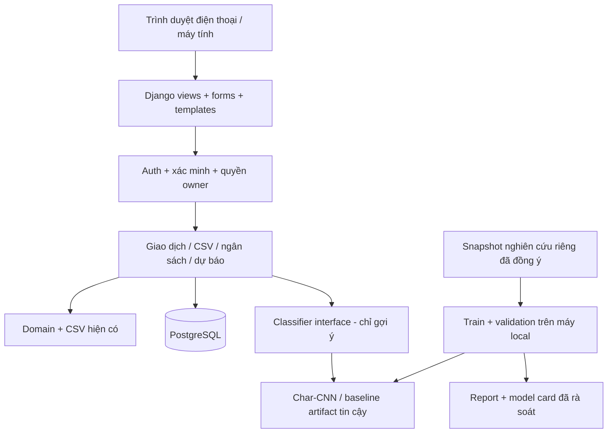

# 02 — Thiết kế v0.2

Ngày: 06/10/2026. Kiến trúc đề xuất; chưa cài thư viện hoặc triển khai các module mới trong lần viết SDD này.

## 1. Các lựa chọn kỹ thuật

| ADR | Lựa chọn | Lý do / kiểm chứng |
|---|---|---|
| V2-ADR-01 | Django monolith, template HTML/CSS responsive | Một backend Python, có ORM/auth/forms/CSRF; giảm số hệ thống phải vận hành cho người làm một mình. Không cần React/microservices ở MVP. |
| V2-ADR-02 | Django auth + django-allauth, email/mật khẩu/session cookie | Xác minh email/reset/rate limit dùng thư viện; không tự viết crypto. Chốt phiên bản tương thích và kiểm tra email trước public. |
| V2-ADR-03 | PostgreSQL cho pilot nhiều tài khoản/public; SQLite chỉ thử local | Đặt constraint, transaction/row lock cho import và ngân sách; kiểm tra tích hợp trên PostgreSQL trước release. |
| V2-ADR-04 | PyTorch Char-CNN nhỏ train từ đầu | Đáp ứng phần neural tự train, đọc mô tả ngắn có/không dấu mà không bắt buộc tokenizer/pretrained/API. Hiệu quả phải đo, không mặc định tốt hơn TF-IDF. |
| V2-ADR-05 | Train GPU local; serving CPU | Máy user báo 3080 10 GB; chưa xác minh CUDA/VRAM/benchmark. Serving không phụ thuộc GPU hosting. |
| V2-ADR-06 | Dự báo tuyến tính theo tốc độ ghi chi tiêu | Có căn cứ để giải thích và kiểm tra khi mới bắt đầu thu lịch sử. Không gọi đây là Deep Learning forecasting. |
| V2-ADR-07 | Hai môi trường mới `.venv-web`, `.venv-train` | Kiểm chứng compatibility riêng, giữ `.venv`/lock cũ; khóa phiên bản sau thử thật. Python 3.12 là ứng viên, không tự cài hoặc hạ Python hệ thống. |

## 2. Kiến trúc và cấu trúc dự kiến



Các đường dẫn sau là **đề xuất sẽ tạo**, không báo đã tồn tại:

```text
src/spendwise/domain/          # kế thừa kiểu giao dịch, thêm budget
src/spendwise/services/        # core nghiệp vụ không phụ thuộc web
src/spendwise/ml/              # baselines + neural + artifact interface
web/manage.py
web/config/                   # settings dev/prod, URL, ASGI/WSGI
web/accounts/                 # auth/custom user đặt từ migration đầu
web/transactions/
web/budgets/
web/templates/
web/static/
scripts/train_classifier.py
scripts/evaluate_classifier.py
requirements-web.in / requirements-web.lock.txt
requirements-train.in / requirements-train.lock.txt
docs/evidence/SW-TASK-*/
```

Giữ code CSV/reports độc lập và wrap bằng services mới; không chuyển toàn bộ sang ORM trong một task. Streamlit demo nếu có là prototype để đối chiếu, không trở thành public app chỉ bằng mở port. Không xóa hoặc chuyển file đang sửa từ chat khác.

## 3. Lưu trữ và ranh giới quyền

| Entity | Trường/hợp đồng chính |
|---|---|
| User | UUID/key server, email được chuẩn hóa và unique không phân biệt hoa/thường, password hash của framework; chỉ collect dữ liệu tài khoản cần thiết |
| Transaction | UUID server, owner FK, date, type, amount_vnd BIGINT, description, confirmed_category, source, source_transaction_id tùy nguồn, source_payload_hash bất biến, revision, timestamps |
| LabelEvent | transaction FK, actor owner, old/new label, suggested label/score/model_version nullable, xác nhận/thời điểm; không có mô tả trong log ứng dụng |
| MonthlyBudget | owner FK, first_day_of_month, total_limit_vnd, revision; unique `(owner, month)` |
| CategoryBudget | budget FK, category slug, limit_vnd; unique `(budget, category)` |
| CoverageConfirmation | owner, month, complete_through_date, confirmed_at, revision; xác nhận đã ghi đầy đủ từ đầu tháng đến ngày này |
| ResearchConsent | owner, version, scopes, granted/revoked_at; mặc định không có đồng ý |

Constraint DB: tiền dương/trong giới hạn, loại/nhãn hợp lệ, thu không có nhãn chi, unique `(owner, source_transaction_id)` khi ID import có giá trị, FK và unique budget. Tổng giới hạn nhóm là invariant nhiều hàng: service dùng transaction + lock hàng MonthlyBudget trước sửa, xét tổng rồi commit. Revision phát hiện form cũ. CRUD/CSV đều kiểm tra owner ở query và service; owner lấy từ session, không từ request payload. Form ID và preview token không phải cơ chế phân quyền.

Đọc chi tiết giao dịch B không sở hữu trả 404 thống nhất; xác thực chưa đủ quyền/quá hạn trả trạng thái theo auth. Query aggregate chỉ có queryset owner đã lọc; không dùng cached dashboard chung giữa người dùng.

## 4. CSV và lưu giao dịch

Kế thừa parse/normalize/hash nguồn trước AI. Import chuẩn không thêm owner trong CSV; `(owner, source ID)` xác định một dòng nguồn. Payload/hash gồm các trường nguồn chuẩn hóa như hợp đồng cũ, không đổi do nhãn xác nhận cuối cùng. Lưu hash bất biến sau lần import, revision riêng cho người dùng chỉnh sửa.

Preview lưu server-side theo owner, opaque token, hash input/revision, hết hạn đề xuất 30 phút. Không dùng cookie session chứa toàn bộ mô tả; không log file. Giao diện có phân trang và xác nhận batch rõ ràng. Commit kiểm tra lại expiry/owner/revision, validate tất cả rows, lock hàng owner để tuần tự hóa import cùng tài khoản, kiểm tra conflicts rồi dùng `transaction.atomic()`. Unique DB là lớp bảo vệ cuối; lỗi rollback, không bỏ qua lỗi để lưu phần còn lại. Giới hạn file ở cả request và parser. Preview hết hạn bị xóa; không dùng dữ liệu preview làm snapshot nghiên cứu.

Với form nhập tay, nonce/idempotency key riêng owner có constraint; POST lặp cùng key không tạo giao dịch mới. Sửa/xóa yêu cầu revision và POST có CSRF. Xóa transaction xóa event liên quan hoặc giữ audit tối thiểu đã bỏ nội dung theo chính sách được ghi; xóa tài khoản không giữ mô tả tài chính trong audit.

## 5. Ngân sách và cảnh báo thực tế

`S_total = sum(amount của expense đã xác nhận trong tháng)`; mỗi `S_category` lọc nhãn cuối cùng. `remaining = B - S` có thể âm. Chỉ hiển thị phần trăm bằng format; xét ngưỡng bằng `100*S >= 80*B`, `S == B`, `S > B` theo thứ tự trạng thái.

Cảnh báo MVP được suy ra từ dữ liệu hiện tại, không là email/push hay một hàng mới mỗi lần reload. Mỗi budget scope hiển thị tối đa một trạng thái thực tế và một trạng thái dự báo riêng; thay đổi dữ liệu khiến trạng thái cập nhật/hết hiệu lực. Đặt ngân sách khi đã chi vẫn tính ngay từ đầu tháng. Income không bù vào expense để né cảnh báo.

## 6. Dự báo có giải thích và cold start

Chỉ dự báo tháng hiện tại. `as_of` là ngày hôm qua theo `Asia/Ho_Chi_Minh`, phải cùng tháng hiện tại. Cần `d >= 7` ngày đã kết thúc, và owner xác nhận ghi đầy đủ từ ngày 1 đến hết `as_of`; ngày không chi vẫn nằm trong mẫu số nhờ xác nhận này. Nếu không đủ trả `{status: insufficient_data, projected_vnd: null, reason}`. Không hiện dự báo 0 hoặc giả confidence.

`D` là số ngày thực của tháng, `S_closed` là chi đến hết `as_of`, `S_now` là tổng chi đã xác nhận đến hiện tại. Tính số nguyên:

```text
trend_vnd = (S_closed * D + d - 1) // d
projected_vnd = max(S_now, trend_vnd)
forecast_alert = projected_vnd > budget_vnd
```

Áp dụng riêng tổng/từng nhóm, dùng cùng coverage của toàn bộ lịch sử tháng. Đầu ra gồm version `pace-v1`, ngày chốt, d/D, S_closed, S_now, projected, budget và lý do. Không cần train, không gán khoảng tin cậy chưa hiệu chuẩn. Tháng đã kết thúc chỉ hiển thị thực tế; tháng tương lai chưa ước tính. Khi sửa/import/xóa giao dịch trong khoảng đã xác nhận, hạ hoặc làm hết hiệu lực coverage và yêu cầu xác nhận lại trước dự báo; số thực tế vẫn cập nhật. Dữ liệu hôm nay không nằm trong S_closed nhưng max bảo đảm ước tính không thấp hơn số đã ghi.

Hạn chế: học phí/tiền nhà tập trung một ngày, chi bất thường và thói quen thay đổi làm tốc độ tuyến tính sai. UI hiển thị “ước tính theo tốc độ ghi chi tiêu”, ngày chốt và việc cần ghi đủ; không khẳng định chắc chắn vượt. Thiết kế bộ backtest theo thời gian ở mục 04 trước khi gọi tính năng hữu ích thực tế.

## 7. Classifier Deep Learning

Một `Classifier` nhận **description** và trả `{label, model_score, model_version, needs_review, reason}`; không nhận tiền/email/owner/group để dự đoán. Normalization NFC/chữ thường/gộp khoảng trắng, giữ dấu. Label map là tám slug, version cố định. Mọi gợi ý cần xác nhận.

Char-CNN khởi đầu (tham số đề xuất, chọn bằng validation): vocab ký tự train-only tối đa 512 gồm PAD/UNK, độ dài 300; embedding 32 chiều → hai nhánh Conv1d 64 filters, kernel 3 và 5, padding giữ chiều dài → ReLU → masked global max pooling theo vị trí ký tự thật → concatenate 128 chiều → Linear 64/ReLU/dropout 0,3 → Linear 8 logits. Embedding và mọi weights khởi tạo ngẫu nhiên rồi học bằng backprop. Câu ngắn vẫn có vị trí hợp lệ; PAD positions không tham gia pooling; UNK có kiểm tra, input rỗng bị từ chối trước model.

CrossEntropyLoss dùng logits; softmax chỉ ở suy luận. AdamW lr thử 1e-3, batch thử 64, tối đa 30 epochs, early stopping patience 5 theo validation macro-F1; class weight nếu có tính từ train. Chỉ thử tập nhỏ hyperparameters đã ghi, lưu mọi run; không seed shopping. Seed khởi đầu 42/43/44 để báo độ dao động, cùng split. GPU dùng nếu thật sự khả dụng; smoke chạy CPU được. AMP là tối ưu tùy chọn sau float32 smoke, không coi bật AMP là điều kiện đạt chất lượng.

Artifact gồm weights-only từ pipeline tin cậy, vocab.json, label_map.json, config, dataset/split/code hashes, threshold chọn validation và model card; xác minh hash/architecture khi load, eval/inference_mode, `map_location=cpu` khi serving. Không load pickle/joblib/torch checkpoint từ nguồn lạ. Artifact thiếu/lỗi trả model_unavailable, không chặn ghi thủ công. Không tải model pretrained hoặc gọi API bên ngoài ở request.

## 8. Môi trường và vận hành

SW-TASK-02 kiểm tra driver/GPU bằng đọc local, chọn wheel PyTorch chính thức tương thích với Python/Windows/CUDA rồi smoke tensor + forward/backward; ghi peak VRAM/tốc độ thực. Không suy ra từ `nvidia-smi` rằng torch đã dùng CUDA. Không chốt CUDA từ số GPU hoặc cài toolkit/đổi driver khi chưa cần. Python 3.14.7/.venv/lock v0.1 đã kiểm chứng cho stack cũ; chưa kiểm chứng stack web/train mới. Thêm ignore cho `.venv-web/`, `.venv-train/` ở task môi trường trước cài.

Public: HTTPS, DEBUG=false, SECRET_KEY riêng qua env, ALLOWED_HOSTS/CSRF trusted origins cấu hình đúng, secure/HttpOnly/SameSite session, CSRF mọi mutation, escaping template, rate limit auth/import/inference và request timeout. Không dùng development server để public. PostgreSQL bền vững, backup có mã hóa/kiểm tra restore, log tránh PII/mô tả/token, staff quyền tối thiểu. Chạy deployment checks và test PostgreSQL/owner trước release.

Không chọn nhà cung cấp ở bản này: miễn phí hosting/DB/email phụ thuộc quota và điều khoản lúc triển khai. SW-TASK-15 phải ghi nguồn chính thức, hạn mức, sleep/storage, cách backup, nguy cơ phí và kết quả end-to-end; không hứa công khai vô hạn/24-7 với 0 đồng. Bản public phục vụ beta với capacity đã đo; nếu tài nguyên chưa đáp ứng giữ trạng thái chưa release.

## 9. Tài liệu chính thức đã đối chiếu ngày 06/10/2026

Thiết kế là suy luận phù hợp phạm vi một người; tài liệu sau xác nhận khả năng và các điều kiện cần kiểm tra, không chứng minh sản phẩm đã an toàn hoặc đã chạy:

- [Django deployment checklist](https://docs.djangoproject.com/en/5.2/howto/deployment/checklist/): kiểm tra cấu hình production, HTTPS/secret và server triển khai.
- [Django custom user](https://docs.djangoproject.com/en/5.2/topics/auth/customizing/): chọn user model trước migration đầu.
- [django-allauth requirements](https://docs.allauth.org/en/latest/installation/requirements.html) và [configuration](https://docs.allauth.org/en/latest/account/configuration.html): kiểm tra compatibility/xác minh email/rate limit.
- [Django email](https://docs.djangoproject.com/en/5.2/topics/email/): backend console chỉ thử local, public cần dịch vụ gửi thực.
- [PyTorch installation](https://pytorch.org/get-started/locally/): chọn build và xác minh CUDA; không copy một lệnh wheel cố định chưa kiểm tra.
- [Conv1d](https://docs.pytorch.org/docs/2.14/generated/torch.nn.modules.conv.Conv1d.html) và [reproducibility](https://docs.pytorch.org/docs/2.14/notes/randomness.html): cấu trúc conv/ghi seed và giới hạn tái lập; phiên bản tài liệu không phải lock đã cài.
